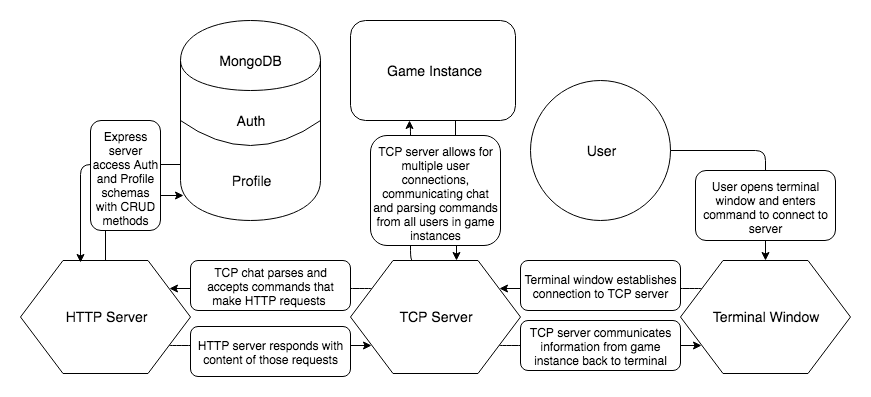

# Game of Thieves                                                                                
* [Overview](#overview)
* [Getting Started](#getting-started)
* [Game Flow](#game-flow)
* [Roles](#roles) | [Town](#town) || [Thieves](#thieves)
* [Commands](#commands) | [General](#general) || [Day Phase Only](#day-phase-only) || [Night Phase Only](#night-phase-only)
* [Components/Modules](#components/modules)
* [Model](#model) | [Auth](#auth) || [Profile](#profile) || [Roles](#roles) || [User](#user)
* [Lib](#lib) | [Basic Auth Middleware](#basic-auth-middleware) || [Commands](#commands) || [Error Handler](#error-handler) || [Game](#game) || [Server (HTTP)](#server-http) || [Server (TCP)](#server-tcp)
* [Route](#route) | [Route Auth](#route-auth) || [Route Profile](#route-profile)
* [Data Flow](#data-flow)
* [Testing](#testing)
* [Workflow](#workflow)
* [Resources](#resources)

**Authors**
* [Ed Abrahamsen](https://github.com/esa2) | github.com/esa2
* [Joel Clair](https://github.com/ClairJ) | github.com/ClairJ
* [Joy Hou](https://github.com/strawbee) | github.com/strawbee
* [Mitchell Massie](https://github.com/futurebound) | github.com/futurebound

**Version**: 1.0.0

***
# Overview
This application is a variant and CLI (command line interface) implementation of a popular social game known as Mafia. It incorporates `MongoDB` to save user profiles and statistics from games a registered user has played. There are multiple roles that will be randomly assigned to each user in game. Roles have two possible affiliations; the `town` or `thieves`. As members of the `town`, the goal is to identify and oust the `thieves` from the game through daily voting sessions.

The game has two phases, day and night. During the day phase all users may communicate through a TCP server, providing any information they find helpful (or harmful) to the identification of the `thieves`. Before the night phase begins, every user can cast a vote on who they believe are affiliated with the `thieves`. The user with the largest amount of votes will be cast out of town. During the night phase, the `thieves` are able to speak with one another and vote on who they want to rob, driving them out of town. Each role has their own unique action they are able to take during the night phase. 

Upon daybreak, the user that was robbed will be removed from the game, and the result of some additional interactions that **may** have occurred will be broadcast to the entire group. If there are no town members remaining at the start of either phase, the `thieves` will have won the game, and visa versa.

***
# Getting Started
To get this application up and running on your local machine, fork and/or clone this repository using the `git clone <git repository link>` command in your terminal. Next, run the `npm install` command, which will install all the necessary dependencies in the accompanying package.json file. If wanting to view tests, enter `npm install -D` into the command line to ensure dev-dependencies have installed. 

After those packages have installed, you can run `npm test` to explore the included tests to ensure everything is functioning as expected. `npm run test:debug` will allow for the use of the `debug` package if dev-dependencies have been installed. You can open up the cloned repository in your favorite editor to explore/modify the code, see how the tests are structured, and create tests of your own if desired. 

Downloading and installing `MongoDB` (see links below) and entering the command `npm run start-db` will initiate the database required for complete functionality in storing records of game sessions, registering users, and gathering statistics for specific user profiles.

**NOTE**: If you'd rather just visit the deployed site instead of downloading and hosting off your local machine, visit [Game of Thieves](gameofthieves.com) at gameofthieves.com. 

If you are cloning and running the application on your local machine, entering `npm start` in your terminal while in the root directory of the application will return a message like this:

```
npm start

> game-of-thieves-back-end@1.0.0 start /../../<root directory>
> node index.js

Connections:  0
server.isOn: true
Listening on <PORT>
  ____                             ____  _             _           _ 
 / ___|  ___ _ ____   _____ _ __  / ___|| |_ __ _ _ __| |_ ___  __| |
 \___ \ / _ \ '__\ \ / / _ \ '__| \___ \| __/ _` | '__| __/ _ \/ _` |
  ___) |  __/ |   \ V /  __/ |     ___) | || (_| | |  | ||  __/ (_| |
 |____/ \___|_|    \_/ \___|_|    |____/ \__\__,_|_|   \__\___|\__,_|
                                                                     
Connections:  1 
Connections:  2, etc. <logs new connections as they are made>
``` 
**NOTE** For windows users, especially those using a PuTTY Telnet client, navigate to your settings and select a box labelled `Implicit CR in every LF`.

Using your command line, you can connect to the server using the following commands:
```
/* NetCat if locally hosting */
nc <IP ADDRESS OF SERVER PC> <PORT>

/* NetCat if vising hosted URL */
nc gameofthieves.com <PORT>

/* Telnet if locally hosting */
telnet <IP ADDRESS OF SERVER PC> <PORT>

/* Telnet if visiting hosted URL */
telnet gameofthieves.com <PORT>
```

Upon successful connection to the server as a user, the terminal window 'welcome screen' will look just like this:
```
    ____                               __   _____ _     _                       
   / ___| __ _ _ __ ___   ___    ___  / _| |_   _| |__ (_) _____   _____  ___   
  | |  _ / _` | '_ ` _ \ / _ \  / _ \| |_    | | | '_ \| |/ _ \ \ / / _ \/ __|  
  | |_| | (_| | | | | | |  __/ | (_) |  _|   | | | | | | |  __/\ V /  __/\__ \  
   \____|\__,_|_| |_| |_|\___|  \___/|_|     |_| |_| |_|_|\___| \_/ \___||___/  
                                                                                
 __________________________________________
/         Welcome,  <Your Username>!       \
| Use @about to read about game mechanics. |
\ Type @help to see a list of commands.    /
 ------------------------------------------
```

***
# Game Flow


Upon successful creation and filling of a game room with 7 users, all users will be broadcast a 'game start' message that tells the user their role, their alignment based off that role, the current day and phase, as well as
```
    ____                        ____  _             _    
   / ___| __ _ _ __ ___   ___  / ___|| |_ __ _ _ __| |_  
  | |  _ / _  | '_   _ \ / _ \ \___ \| __/ _  | '__| __| 
  | |_| | (_| | | | | | |  __/  ___) | || (_| | |  | |_  
   \____|\__,_|_| |_| |_|\___| |____/ \__\__,_|_|   \__| 

 ______________________________________________________________________
/ <Username>, your role is <role>, alignment: <town || thieves>        \
| [ DAY 0, Night PHASE ] Use your night actions now.                   |
|                                                                      |
|                 Players (7):                                         |
\ <User 1>, <User 2>, <User 3>, <User 4>, <User 5>, <User 6>, <User 7> /
 ----------------------------------------------------------------------
```
Upon entering the day phase, all users in the game will be broadcast a message summarizing any public events that occurred overnight. If nobody was robbed, the message will look like this:

```
 ______________________________________________________________________
/ NEW PHASE: day <number>, day phase                                   \
|                                                                      |
| No one was robbed!                                                   |
|                                                                      |
|                                                                      |
|                                                                      |
|         Players Left (7):                                            |
\ <User 1>, <User 2>, <User 3>, <User 4>, <User 5>, <User 6>, <User 7> /
 ----------------------------------------------------------------------
 ```
Alternatively:

```
 ____________________________________________________________
/ NEW PHASE: day <number>, day phase                         \
|                                                            |
| <User 7> was robbed and had to leave town.                 |
| <User 7>'s role was <ROLE>.                                |
| <User 7>'s last words: <None || All last words>            |
|                                                            |
|                                                            |
|                                                            |
|         Players Left (6):                                  |
\ <User 1>, <User 2>, <User 3>, <User 4>, <User 5>, <User 6> /
 ------------------------------------------------------------
```
Upon entering the night phase after the first day phase, if votes were tied or no votes were cast, all users will be broadcast the following message.
```
 ____________________________________________________________
/ NEW PHASE: day <number>, night phase                       \
|                                                            |
| <No votes || Vote was tied>, no arrests!                   |
|                                                            |
|         Players Left (6):                                  |
\ <User 1>, <User 2>, <User 3>, <User 4>, <User 5>, <User 6> /
 ------------------------------------------------------------
```
Alternatively, if a user was selected by vote:
```
 __________________________________________________
/ NEW PHASE: day <number>, night phase             \
|                                                  |
| <User 4> [role: <ROLE>] was arrested.            |
| <User 4>'s last words: <None || last words>      |
|                                                  |
|         Players Left (5):                        |
\ <User 1>, <User 2>, <User 3>, <User 5>, <User 6> /
 --------------------------------------------------
```


Once all players with the `thieves` affiliation have been removed from the game, the channel will be broadcast a 'game-over' message:
```
   _____                    __        ___           _  
  |_   _|____      ___ __   \ \      / (_)_ __  ___| | 
    | |/ _ \ \ /\ / / '_ \   \ \ /\ / /| | '_ \/ __| | 
    | | (_) \ V  V /| | | |   \ V  V / | | | | \__ \_| 
    |_|\___/ \_/\_/ |_| |_|    \_/\_/  |_|_| |_|___(_) 
                                                       
 _________________________________________________________________
< Thank you for playing! You will be redirected to the home room. >
 -----------------------------------------------------------------
```
Alternatively, if no `town` affiliated players remain:
```
  _____ _     _                      __        ___       _  
 |_   _| |__ (_) _____   _____  ___  \ \      / (_)_ __ | | 
   | | | '_ \| |/ _ \ \ / / _ \/ __|  \ \ /\ / /| | '_ \| | 
   | | | | | | |  __/\ V /  __/\__ \   \ V  V / | | | | |_| 
   |_| |_| |_|_|\___| \_/ \___||___/    \_/\_/  |_|_| |_(_) 

 _________________________________________________________________
< Thank you for playing! You will be redirected to the home room. >
 -----------------------------------------------------------------
```

# Roles
There are currently 7 roles and 1 sub-role in the game, and more can be added as desired with proper logic refactoring (over 30 roles in some Mafia variants). These roles are:

## Town
* **Cop:** Can investigate one player each night. Receives "town" or "thief" result for that player.
* **Creeper:** Can see who one player targeted each night. If the targeted player performs a night action, the creeper will receive a result of who the action was directed toward. If the targeted player does not perform an action, no result will be received.
* **Dentist:** Can visit one player at night and perform dental procedures. The targeted player is muted during the next day phase and cannot speak, but can still use actions.
* **Jailor:** Can prevent one player's night action. If targeted player performs a night action, their action will not take effect.
* **Locksmith:** Can protect one player each night from being robbed. If targeted player is also targeted by the thief, nothing will happen. 

## Thieves
* **Junior Thief (Sub-role):** The junior thief is a formerly town-aligned player who has been recruited by the thief recruiter. The junior thief cannot use any night actions, but can talk with fellow thieves during the night phase.
* **Thief:** Can rob one player each night. Can speak at night to other thieves to coordinate action. If robbery is successful, the player will leave the town (game) at the next day phase.
* **Thief Recruiter:** Can cause one town-aligned player to become a thief. Ability can only be used once a game. The recruiter cannot be blocked by the jailor. If recruitment is successful, the targeted player will receive notification that s/he has become a thief at the next day phase, and the targeted player's night action for the current night will not take effect.

# Commands
The format of the following commands is the command entered by a user, followed by the printed response in their terminal window (represented by code blocks).
## General
**`@about`** Describes the basic game mechanics to users to help those unfamiliar udnerstand the flow of the game.
```
     _    _                 _      ____     _____   
    / \  | |__   ___  _   _| |_   / ___| __|_   _|  
   / _ \ | '_ \ / _ \| | | | __| | |  _ / _ \| |    
  / ___ \| |_) | (_) | |_| | |_  | |_| | (_) | |    
 /_/   \_\_.__/ \___/ \__,_|\__|  \____|\___/|_|    
                                                     
The game starts when there are 7 players in a room. Users
are randomly assigned roles that determine their night
actions and their alignment (town or thief). Each player
does not know others' roles.
The game starts with the night phase, where each player
can use their night actions. Only thieves can talk during
the night phase and townspeople cannot see the chat. The
thieves choose one player to rob during the night, and the
robbed player is forced to leave the game (leave town) the
next day, unless a blocking action occurs. The night phase
is one minute long.
During the day phase, all players choose to vote one player
out of the game (jail them for suspected robbery). The game
ends when no thieves are left or when no town are left.
    Type @help to see the available list of commands.
```

**`@create <room>`** Creates a game room with a custom name 
```
 you have created the room <room>.
```

**`@join <room>`** Joins a custom game room.
```
 <Your Username> has joined the room <room>. 
 Players: <number>; <number> more players needed.
```

**`@help`** Lists all available commands with descriptions.
```
   _   _      _         __  __                   
  | | | | ___| |_ __   |  \/  | ___ _ __  _   _  
  | |_| |/ _ \ | '_ \  | |\/| |/ _ \ '_ \| | | | 
  |  _  |  __/ | |_) | | |  | |  __/ | | | |_| | 
  |_| |_|\___|_| .__/  |_|  |_|\___|_| |_|\__,_| 
               |_|                               
 ==================== Game Commands =====================
 @about - about game mechanics
 @create <room> - creates a game room
 @join <room> - joins a game room
 @rooms - lists all active rooms
 @roles - lists all possible roles
 @me - lists own name, current room, and role
 @players - lists active players in room
 @phase - lists current day and phase in game
 @quit - quits the game
 =============== Day Phase Only Commands ================
 @vote <playername> - votes to jail a player
 @votes - shows list of current votes for the day
 ============== Night Phase Only Commands ===============
 @action <playername> - performs respective night action
     for role
 @lastwords - save player's last words to output to room 
     in case the user is evicted or jailed
```

**`@me`** Lists your username, name of current room, and your current role.
```
 ===== USER ===== 
 Name: <your username> 
 Room: <room> 
 Role: <YOUR ROLE>
```

**`@phase`** Lists current day and phase in game (e.g. Day 3, Night Phase).
```
 Currently on day <number>, <day || night> phase. 
```

**`@players`** Lists all active players in the room.
```
 Active users playing in room <room> (7): 
 <User 1>, <User 2>, <User 3>, <User 4>, <User 5>, <User 6>, <User 7>
```

**`@roles`** Lists all possible roles.
```
    ____                        ____       _            
   / ___| __ _ _ __ ___   ___  |  _ \ ___ | | ___  ___  
  | |  _ / _' | '_ ' _ \ / _ \ | |_) / _ \| |/ _ \/ __| 
  | |_| | (_| | | | | | |  __/ |  _ < (_) | |  __/\__ \ 
   \____|\__,_|_| |_| |_|\___| |_| \_\___/|_|\___||___/ 
                                                        
 Players cannot perform night actions on themselves.
 
 [ COP ] town
 Can investigate one player each night. Receives "town" or "thief" 
 result for that player. Use @action <playername> at night to investigate.

 [ LOCKSMITH ] town
 Can protect one player each night from being robbed. If targeted player 
 is also targeted by the thief, nothing will happen. Receives no result 
 back. Use @action <playername> to protect a player at night.

 [ JAILOR ] town
 Can prevent one player's night action. If targeted player performs a 
 night action, their action will not take effect. Receives no result back. 
 Use @action <playername> to jail a player at night.

 [ CREEPER ] town
 Can see who one player targeted each night. If the targeted player 
 performs a night action, the creeper will receive a result of who the 
 action was directed toward. If the targeted player does not perform an 
 action, no result will be received. Use @action <playername> to stalk a 
 player at night.

 [ DENTIST ] town
 Can visit one player at night and perform dental procedures. The targeted 
 player is muted during the next day phase and cannot speak, but can still 
 use actions. Receives no result back. Use @action <playername> to mute a 
 player at night.

 [ THIEF ] thief
 Can rob one player each night. Can speak at night to other thieves to 
 coordinate action. If robbery is successful, the player will leave the 
 town (game) at the next day phase. Use @action <playername> to rob a 
 player at night.

 [ THIEF RECRUITER ] thief
 Can cause one town-aligned player to become a thief. Ability can only 
 be used once a game. The recruiter cannot be blocked by the jailor. If 
 recruitment is successful, the targeted player will receive notification 
 that s/he has become a thief at the next day phase, and the targeted 
 player's night action for the current night will not take effect. Use 
 @action <playername> at night to recruit.

 [ JUNIOR THIEF ] thief
 The junior thief is a formerly town-aligned player who has been recruited by 
 the thief recruiter. The junior thief cannot use any night actions, but 
 can talk with fellow thieves during the night phase.
```

**`@rooms`** Lists all active game rooms, in case the creator forgot to mention it to their party.
```
 Room(#players): home(<number>) <room 1>(<number>) <room 2 if appliccable>(<number>) 
```

**`@quit`** Removes the user from current game and closes connection to the server.
```
 See you later, <your username>
```
Additionally, when you leave the game all users are broadcast this message:
```
 <quitting username> has quit the game. <quitting username>'s role was <ROLE>.
```

## Day Phase Only
**`@vote <playername>`** Submits a vote for the specified player to be jailed (removed from the game).
```
 ##VOTE: <your username>: <target username>.
 Use @votes to see current votes for the day.
```

**`@votes`** Shows current vote tallies and players they belong to.
```
 <targeted username>: <number>
 <targeted username (if multiple)> : <number> 
```

## Night Phase Only
**`@action <playername>`** Submits an action to be performed on the specified player. Returns a message to the user upon successful registration of the action.
```
 Your night action has been recorded. 
```

**`@lastwords <journal entry here>`** Saves a journal of whatever follows the `@lastwords` command to be broadcast to other users if they are removed from the game either by the thief or by being voted out. Gives users the ability to record what they did at night, what their role was, and anything important they feel should be shared.
```
 Your last words have been recorded. 
```

***
# Components/Modules
This application utilizes an `index.js` entry point, which starts both the TCP and HTTP servers listening on their specified ports.

## Model
### Auth
The `auth` module exports a single `Mongoose` schema. It has `username`, `password` and `compareHash` properties. The first two are required and values are expected to be in the form of strings. There are 4 methods attached to the `Auth` schema:
* **`generatePasswordHash(password)`** Expects a single password argument, and utilizes `bcrypt` to hash and store a reference to the original password entered by the user. This allows the application to toss the original plain-text password, and store only the hash. If there is no password passed as an argument, the method will return a Promise rejection passing on an `Authorization` error.
* **`comparePasswordHash(password)`** Expects a single password argument, and utilizes `bcrypt` to compare a stored password hash for an `Auth` schema instance with the password supplied in an HTTP request. If the password hashes match, it will return a Promise resolve and allow the application to proceed. If `bcrypt` does not return `valid` as the result of the comparison, the function will reject a new `Authorization` error.
* **`generateCompareHash()`** Expects no arguments, and uses `crypto` to generate and save a compareHash to be stored on the `Auth` instance as the value of the property on the schema.
* **`generateToken()`** Expects no arguments, and uses `jwt` to create and return a token to the user that will accompany future requests in the same session of the application.

### Profile
The `profile` module exports a single `Mongoose` schema as well. It has `gamesPlayed`, `gamesWon`, `percentWon`, `username`, and `userId` properties. The first 4 are expected to be strings, and only the last 2 are required.
* **`gamesPlayed`** Tracks the amount of games the player has participated in.
* **`gamesWon`** Tracks the amount of games the player has won.
* **`percentWon`** Calculates the win percentage of the player.
* **`username`** The players chosen username while registering on with the DB.
* **`userId`** A `Mongoose` id referenced from the related `auth` schema.

### Roles
The `roles` module exports a single `roles` object, with nested objects that correlate to the possible random role assignments to every user in a game session. Each nested object has `name`, `alignment`, and `action` properties. 
* **`name`** Refers to the role name, such as cop, jailor, or thief.
* **`alignment`** Determines the alignment that each role belongs to, and the win condition of each player.
* **`action`** Function available to each role, which determines the target of their nightly action and returns a success message to the user when they properly enter the `@action <target>` command.

### User
The `user` module exports a single anonymous function and utilizes `faker` to create random nicknames for users while connected to the TCP server. It is used for current sessions to store individual socket connections for use in other modules and track the server a user is currently logged into.

## Lib
### Basic Auth Middleware
The **`basic-auth-middlware`** module exports a single anonymous function expecting three arguments, req, res, and next. It validates that there are authorization headers accompanying HTTP requests, as well as the presence of both username and password information sent along in those headers. On success, it calls next at the end of the function to continue the processing of the request.

### Commands
The **`commands`** module serves as a massive command parser/interpreter. It is home to many switch cases and other conditional logic. It checks whether the text it recieves starts with the special command character `@` and if it does, it determines which command has been entered and serves the proper response. It requires in and utilizes `superagent`, `bad-words`, and `chalk` as well as the `server`, `game`, and `roles` modules.

### Error Handler
The **`error-handler`** module exports a single anonymous function expecting `err` and `res` arguments. It forces the error message it receives to lower case, and determines whether the message includes certain expected words or phrases through the use of switch cases, and serves the appropriate status code as well as the error name and message.

### Game
JH
* **`checkWinner(user)`**
* **`phase()`**
* **`tallyDayVotes(user)`**
* **`nightActions(user)`**

### Server (HTTP)
The **`http`** module utilizes `cors`, `express`, and `mongoose`. It requires in the `errorHandler`, `route-auth`, and `route-profile` modules. It exports a single `server` object, instantiates an `express` server, specifies endpoints and passes the router instance to the `route` modules. It also attaches `server.start()` and `server.stop()` methods to the server. These methods also connect and disconnect from `mongoose` and the `MongoDB` respectively. 

### Server (TCP)
The **`server`** module utilizes `cowsay`, `chalk`, `figlet`, `net`, and `superagent`. It also requires in the `user` and `commands` modules. It exports a `net` server, with multiple event listeners that manages and supports multiple active chatrooms, the entry and exit from those chatrooms, as well as defines `server.start()` and `server.stop()` methods.

## Route
### Route Auth
The **`route-auth`** utilizes `bodyParser` and requires in the `auth` and `profile` schemas, as well as the `basic-auth-middleware` and `error-handler` modules. It module exports a single anonymous function expecting a `router` argument. The exported file has CRUD methods mounted on the router for the `/register` and `/login` endpoints, `POST`ing and `GET`ing respectively.

### Route Profile
The **`route-profile`** module utilizes `bodyParser` and requires in the `profile` schema and `error-handler` module. It exports a single anonymous function expecting a `router` argument. The exported file has CRUD methods mounted on the router for the `/profile`, `/profile/:userID`, and `/profile/:_id?` endpoints. `PUT` incorporates the `body-parser` middleware for the purposes described above. `GET` incorporates the custom `basicAuth` middleware to validate authorization for retreival of information.

***
# Data Flow


***
# Testing

***
# Resources
* [Bad Words](https://www.npmjs.com/package/bad-words) ~ npmjs.com/package/bad-words
* [BCrypt](https://www.npmjs.com/package/bcrypt) ~ npmjs.com/package/bcrypt
* [Body Parser](https://www.npmjs.com/package/body-parser) ~ npmjs.com/package/body-parser
* [Chalk](https://www.npmjs.com/package/chalk) ~ npmjs.com/package/chalk
* [Cors](https://www.npmjs.com/package/cors) ~ npmjs.com/package/cors
* [Crypto](https://nodejs.org/api/crypto.html) ~ nodejs.org/api/crypto.html
* [Dotenv](https://www.npmjs.com/package/dotenv) ~ npmjs.com/package/dotenv
* [ESLint](https://www.npmjs.com/package/eslint) ~ npmjs.com/package/eslint
* [Jest](https://facebook.github.io/jest/) ~ facebook.github.io/jest/
* [JSON Web Token](https://www.npmjs.com/package/jsonwebtoken) ~ npmjs.com/package/jsonwebtoken
* [MongoDB](https://docs.mongodb.com/) ~ docs.mongodb.com
* [Mongoose](http://mongoosejs.com/docs/guide.html) ~ mongoosejs.com/docs/guide.html
* [Net](https://nodejs.org/api/net.html) ~ nodejs.org/api/net.html
* [Superagent](http://visionmedia.github.io/superagent/) ~ visionmedia.github.io/superagent

**[Top](#game-of-thieves)**