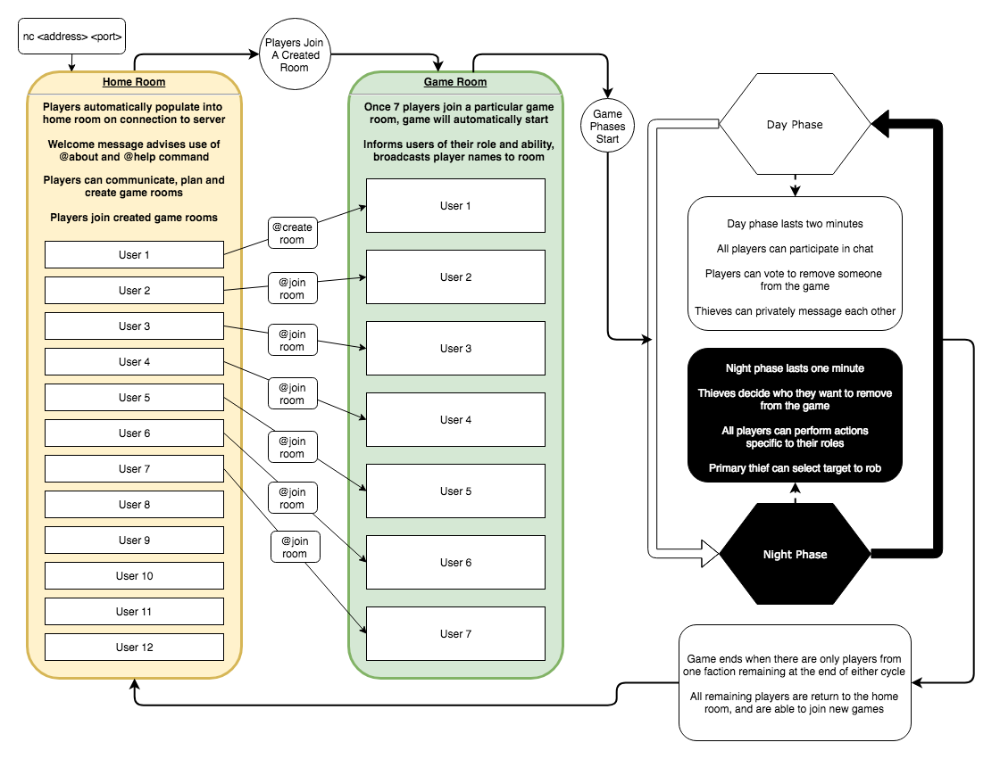

# Game of Thieves
**Authors**
* [Ed Abrahamsen](https://github.com/esa2) | github.com/esa2
* [Joel Clair](https://github.com/ClairJ) | github.com/ClairJ
* [Joy Hou](https://github.com/strawbee) | github.com/strawbee
* [Mitchell Massie](https://github.com/futurebound) | github.com/futurebound

**Version**: 1.0.0

***
## Overview
This application is an variant and implementation of a popular social game known as Mafia. Users are able to create and store profiles through the use of a `MongoDB` database, and using these profiles, gain access to rooms of up to 7 players. There are multiple roles that will be randomly assigned to each user in a particular session. Those roles have two possible affiliations: the `town` and the `thieves`. As one may be able to guess, there are different win conditions for these two affiliations. As members of the `town`, the goal is to identify and oust the `thieves` from the game through daily voting sessions.

The game has two phases, day and night. During the day phase all users may communicate through a TCP server, providing any information they find helpful (or harmful) to the identification of the `thieves`. Before the night phase begins, every user can cast a vote on who they believe are affiliated with the `thieves`. The user with the largest amount of votes will be cast out of town. During the night phase, the `thieves` are able to speak with one another and vote on who they want to rob, driving them out of town. Each role has their own unique action they are able to take during the night phase. Upon daybreak, the user that was robbed will be removed from the game, and the result of some additional interactions that _may_ have occurred will be broadcast to the entire group.

If there are no town members remaining at the start of either phase, the `thieves` will have won the game, and visa versa.



***
## Getting Started
To get this application up and running on your local machine, fork and/or clone this repository using the `git clone <git repository link>` command in your terminal. Next, run the `npm install` command, which will install all the necessary dependencies in the accompanying package.json file. If wanting to view tests, enter `npm install -D` into the command line. 

After those packages have installed, you can run `npm test` to explore the included tests to ensure everything is functioning as expected. `npm run test:debug` will allow for the use of the `debug` package if dev-dependencies have been installed. You can open up the cloned repository in your favorite editor to explore/modify the code, see how the tests are structured, and create tests of your own if desired. 

<!-- Downloading and installing `MongoDB` (see links below) and entering the command `npm run start-db` will initiate the database required for complete functionality in storing records of game sessions, and gathering statistics for specific user profiles. -->

**NOTE**: If you`d rather just visit the deployed site instead of downloading and hosting off your local machine, visit <[Game of Thieves](gameofthieves.com)>. 

Using your command line, you can connect to the server using the following commands:
```
/* NetCat if locally hosting */
nc <IP ADDRESS OF SERVER PC> <PORT>

/* NetCat if vising hosted URL */
nc gameofthieves.com <PORT>

/* Telnet if locally hosting */
telnet <IP ADDRESS OF SERVER PC> <PORT>

/* Telnet if visiting hosted URL */
telnet gameofthieves.com <PORT>
```

<!-- You can make a HTTP `POST` request using `HTTPie`, `Postman`, or a comparable tool to create a profile. This request will need to include `username`, `password`, and `email` properties all in the form of strings. With `HTTPie`, your request should look like:
```
/* local machine */
http POST :3000/signup username=myUsername password=myPassword email=emailHandle@email.com

/* deployed */
http POST <Heroku URL>/signup username=myUsername password=myPassword email=emailHandle@email.com
```
If you are using `Postman`, it's a little more complicated. After installing `Postman` you can click on the box in the top left out of 6 options upon opening the application that says `Make a Request`. From there, you can choose from a dropdown that defaults to `GET` and change the request type to `POST`, enter the desired path of `localhost:<PORT>/signup`, change ideally the `Body` tab below the `URL` entry area, click on `raw`, and then enter the above properties as bonafied JSON. Your request body should look like:
```
{
  "username": "<myUsername>",
  "password": "<myPassword>", 
  "email": "<myEmail>"
}
```-->
***
## Components/Modules

***
## Description

### Roles
`roles.js` in the `model/` directory is home to the possible random role assignments to every user in a game session. Each nested object has `name`, `alignment`, and `action` properties.
* `name` refers to the role name, such as cop, jailor, or thief.
* `order` is a visual and functional reminder .
* 
* 

### Commands

***
## Data Flow


***
## Credits
* [BCrypt](https://www.npmjs.com/package/bcrypt) ~ https://www.npmjs.com/package/bcrypt
* [Body Parser](https://www.npmjs.com/package/body-parser) ~ https://www.npmjs.com/package/body-parser
* [Crypto](https://nodejs.org/api/crypto.html) ~ https://nodejs.org/api/crypto.html
* [Dotenv](https://www.npmjs.com/package/dotenv) ~ https://www.npmjs.com/package/dotenv
* [ESLint](https://www.npmjs.com/package/eslint) ~ https://www.npmjs.com/package/eslint
* [Jest](https://facebook.github.io/jest/) ~ https://facebook.github.io/jest/
* [JSON Web Token](https://www.npmjs.com/package/jsonwebtoken) ~ https://www.npmjs.com/package/jsonwebtoken
* [MongoDB](https://docs.mongodb.com/) ~ https://docs.mongodb.com/
* [Mongoose](http://mongoosejs.com/docs/guide.html) ~ http://mongoosejs.com/docs/guide.html
* [Net](https://nodejs.org/api/net.html) ~ https://nodejs.org/api/net.html
